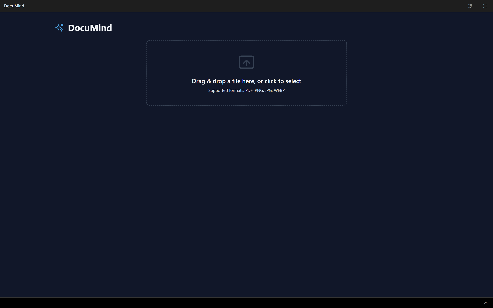
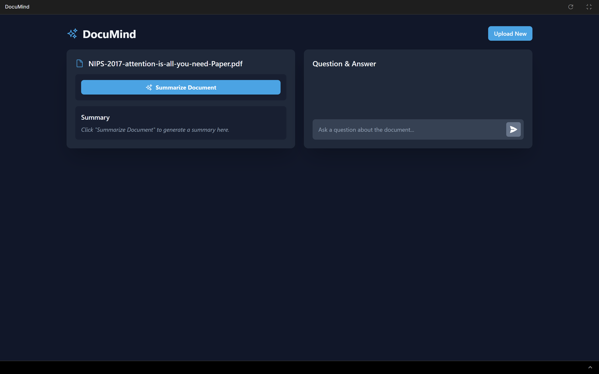
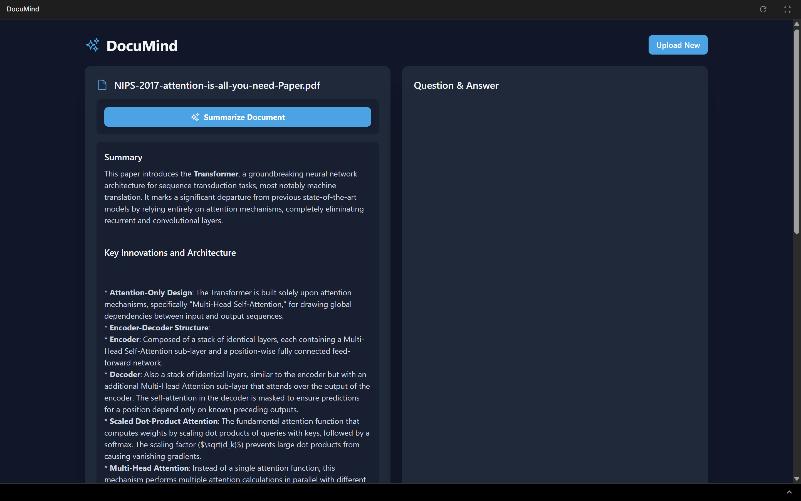
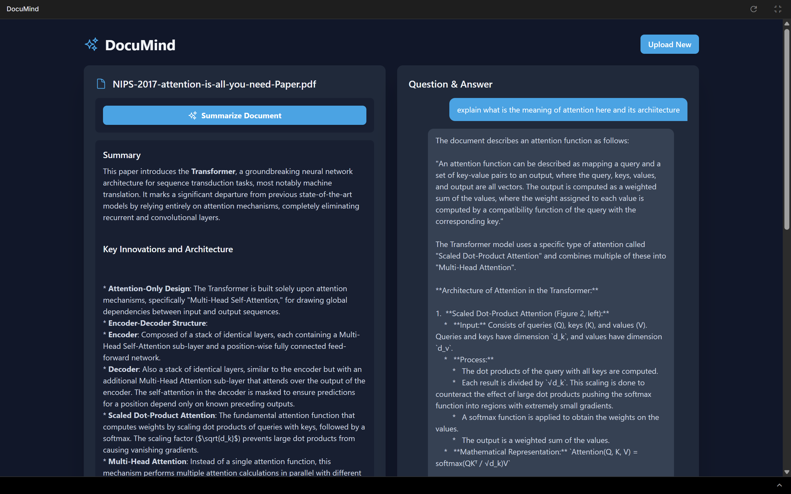

# DocuMind: AI-Powered Multimodal Document Analysis

  
  
  
  

  <strong>DocuMind is an intelligent, client-side web application that leverages the power of Google's state-of-the-art Large Language Models (LLMs) to unlock insights from your documents. Upload PDFs or images and engage in a dynamic conversation to summarize, query, and understand your content like never before.</strong>

---

## 📋 Table of Contents

- [✨ Core AI Capabilities](#-core-ai-capabilities)
  - [🧠 Multimodal Understanding](#-multimodal-understanding)
  - [📄 Intelligent Summarization](#-intelligent-summarization)
  - [💬 RAG-Powered Conversational Q&A](#-rag-powered-conversational-qa)
- [📸 Application Preview](#-application-preview)
- [🚀 How It Works: The AI Pipeline](#-how-it-works-the-ai-pipeline)
- [🛠️ Technology Showcase](#️-technology-showcase)
- [⚙️ Getting Started](#️-getting-started)
- [🧑‍💻 Usage Guide](#-usage-guide)
- [👤 Author](#-author)

---

## ✨ Core AI Capabilities

DocuMind's intelligence is driven entirely by the **Google Gemini `gemini-2.5-flash` model**. This section details how we harness its advanced LLM capabilities to deliver a powerful user experience.

### 🧠 Multimodal Understanding

At its core, DocuMind utilizes a **Vision Language Model (VLM)**. This means it doesn't just *read* text; it can *see* and interpret visual information.

-   **For PDFs**: We extract the raw text client-side and feed it to the LLM as a rich textual context.
-   **For Images**: Whether it's a scanned document, an invoice with a chart, or a diagram, the image is sent directly to the Gemini API. The LLM's vision capabilities perform on-the-fly Optical Character Recognition (OCR) and spatial understanding to interpret the content.

This multimodal approach allows you to ask questions about a bar chart in an annual report or get the total from a photographed invoice as seamlessly as querying a text-based document.

### 📄 Intelligent Summarization

Instead of using basic extraction algorithms, DocuMind prompts the LLM to perform **abstractive summarization**.

> We instruct the model: *"You are an expert summarizer. Provide a concise, easy-to-read summary... capturing the key points and main ideas."*

The LLM reads the *entire* document context (text or image) and generates a new, coherent summary in natural language, formatted beautifully in markdown for maximum readability.

### 💬 RAG-Powered Conversational Q&A

The chat interface is the most powerful feature, employing a **Retrieval-Augmented Generation (RAG)** pattern to ensure factual accuracy and prevent AI "hallucinations."

**How our RAG approach works:**

1.  **Grounding in Context**: The entire content of your uploaded document serves as the "single source of truth."
2.  **Strict Prompt Engineering**: Every question you ask is wrapped in a meticulously crafted prompt that instructs the LLM:
    > *"You are a helpful assistant specialized in answering questions based **only** on the provided document context... If the answer is not found in the document, you MUST state: 'I could not find an answer...'"*
3.  **Contextual Conversation**: The model is also fed the recent chat history, allowing it to understand follow-up questions ("What about the second point you mentioned?") while still being strictly bound to the document's content for its answers.

This turns the LLM from a general-purpose knowledge engine into a dedicated expert on *your* specific document, providing trustworthy, context-aware answers.

---

## 📸 Application Preview

*
The main interface, showing the document summary and the Q&A chat panel.
*

---

## 🚀 How It Works: The AI Pipeline

DocuMind operates entirely on the client-side, ensuring your documents remain private. Here's a step-by-step breakdown of the data flow from upload to answer.

1.  **File Upload**: The user uploads a PDF or an image (`.png`, `.jpg`, `.webp`).
2.  **Client-Side Pre-processing**:
    -   **PDF**: Mozilla's `pdf.js` library is used in the browser to parse the PDF and extract its complete textual content. No data is sent to a server for this step.
    -   **Image**: The browser's `FileReader` API converts the image into a base64 string, preparing it for the API request.
3.  **LLM Interaction (The Gemini API Call)**:
    -   The extracted text or the base64 image data is packaged into a request payload.
    -   The user's prompt (e.g., "Summarize this" or "What is the total cost?") is combined with our RAG instructions.
    -   This payload is sent securely to the Google Gemini API endpoint.
4.  **Response Generation & Display**:
    -   The Gemini model processes the request and generates a response based *only* on the provided context.
    -   The response (a summary or an answer) is sent back to the application.
    -   The UI updates in real-time to display the generated text in the appropriate panel.

---

## 🛠️ Technology Showcase

-   **Frontend**: **React 18** with TypeScript for a modern, type-safe, and component-based architecture.
-   **AI Engine**: **Google Gemini API (`gemini-2.5-flash`)**. We chose this model for its exceptional balance of speed, intelligence, and powerful multimodal (text and vision) capabilities.
-   **Styling**: **Tailwind CSS** for a utility-first, responsive, and highly customizable design system that enables rapid development of a beautiful UI.
-   **Document Processing**:
    -   **PDFs**: **Mozilla's `pdf.js`** for robust, client-side PDF text extraction without server dependencies.
    -   **File Handling**: **React Dropzone** for a seamless and accessible drag-and-drop file upload experience.

---

## ⚙️ Getting Started

### Prerequisites

-   A modern web browser (Chrome, Firefox, Safari, Edge).
-   A Google Gemini API key.

### Environment Setup

The application requires a Google Gemini API key to communicate with the language model.

1.  Obtain your API key from [Google AI Studio](https://aistudio.google.com/app/apikey).
2.  The application is architected to securely access this key via the `process.env.API_KEY` environment variable. In a deployed environment (like Vercel, Netlify, or a custom server), this key must be configured in the environment settings.

**Security Note**: Never expose your API key in client-side code. This project assumes the build environment correctly handles and secures environment variables.

---

## 🧑‍💻 Usage Guide

1.  **Upload Your Document**: Drag and drop a supported file into the upload zone or click to browse your local files.

    

2.  **Generate a Summary**: Once the file is processed, click the "Summarize Document" button. The AI will read the entire document and generate a high-quality summary on the left panel.

    

3.  **Ask Questions**: Use the chat interface on the right to ask specific questions about the document. Press Enter or click the send button to get an AI-powered answer grounded in the document's content.

    

---

## 👤 Author

Made by **Vaibhav Shikhar Singh**.
